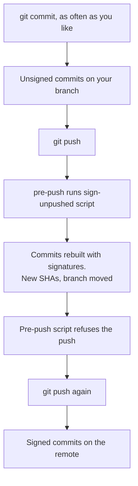

# git-sign-on-push

Sign commits when you push them, not when you make them.

## What it changes

`commit.gpgsign=true` signs every commit at `git commit` time, including the ones you amend or drop
in a rebase an hour later. This sets `commit.gpgsign=false` and hands the job to a `pre-push` hook.
You get one signature per commit that actually leaves the machine.

## What happens when you commit and push



`git up` replaces the last three steps with one command.

## How the signing works

`sign-unpushed` lists the commits the remote does not have yet and rebuilds each one with
`git commit-tree -S`. Author and committer names, emails and dates are copied across. Merges are
kept. Branches you do not have checked out are fine, and so is a dirty working tree, because
nothing touches the index or your files. `git rebase --gpg-sign` needs a clean tree and a checkout.

Every rebuilt commit gets a new SHA. The signature is stored inside the commit object as a `gpgsig`
header, so the hash changes with it. Commits that are already on the remote are never touched.

Before it signs anything, the script prints what it is about to sign:

```
sign-unpushed: signing main:
  d4d9eab4  Steven Rombauts  First test commit with a fairly long subject line
  c69b85c4  Jane Contributor  Second commit, authored by someone else
sign-unpushed: signed main (c69b85c -> cf06817)
```

## Which commits are skipped

A commit is left alone when it is already signed, or when its committer email does not match
`user.email`.

That rule has a limit. If someone else's unsigned commit sits **on top** of one you sign, its parent
SHA changes, so it has to be rebuilt too, and it comes back carrying your signature. Rewriting a
commit rewrites every commit above it. If that matters on a shared branch, push their commits first,
then sign yours on top.

## Why the hook refuses the first push

Git decides which SHAs to send before it runs `pre-push`. Signing produces different SHAs. If the
hook signed and then exited 0, git would send the old unsigned commits and your branch would sit
ahead of the remote. So the hook signs and fails:

```
pre-push: commits were signed. Run your push again to send them.
```

Run the push again and the signed commits go out. `git up` skips that second push: it signs first,
then pushes, and the hook finds nothing left to do. The hook still catches plain `git push`, your
IDE and anything else that pushes for you.

## Install in one repo

```sh
cd /path/to/repo
/path/to/git-sign-on-push/install.sh
```

It copies `sign-unpushed` and `pre-push` into `.git/hooks/`, which git does not track, and sets four
local keys:

| Key | Value |
| --- | --- |
| `commit.gpgsign` | `false` |
| `user.signingkey` | read from your existing `gpg.signingkey` or `user.signingkey` |
| `alias.up` | sign, then push the current branch |
| `alias.upup` | sign, then force-push the current branch |

`tag.gpgsign` is left alone, so tags keep signing at creation time.

The script stops if `.git/hooks/pre-push` already exists with different contents, or if the repo has
`core.hooksPath` set. `--force` overrides both.

## Install for every repo

Point `core.hooksPath` at one copy of the hooks instead of running `install.sh` per repo:

```sh
mkdir -p ~/.config/git/hooks
cp sign-unpushed pre-push ~/.config/git/hooks/
chmod +x ~/.config/git/hooks/sign-unpushed ~/.config/git/hooks/pre-push

git config --global core.hooksPath ~/.config/git/hooks
git config --global commit.gpgsign false
git config --global user.signingkey YOUR_KEY_ID
git config --global alias.up   '!f() { ~/.config/git/hooks/sign-unpushed; rc=$?; [ $rc -eq 0 ] || [ $rc -eq 10 ] || exit $rc; git push origin "$(git rev-parse --abbrev-ref HEAD)" "$@"; }; f'
git config --global alias.upup '!f() { ~/.config/git/hooks/sign-unpushed; rc=$?; [ $rc -eq 0 ] || [ $rc -eq 10 ] || exit $rc; git push --force origin "$(git rev-parse --abbrev-ref HEAD)" "$@"; }; f'
```

Read these four before you run it:

- **`core.hooksPath` switches off `.git/hooks` in every repo.** The `pre-push` here covers itself: after signing, it runs
  `.git/hooks/pre-push` with the same stdin lines when the repo has one. Other hook types
  (`pre-commit`, `commit-msg`) need the same wrapper, or a symlink from `~/.config/git/hooks/<name>`
  per repo.
- **A repo with its own `core.hooksPath` opts out, silently.** Local config beats global, so the
  signing hook never runs there and nothing reports it. Commits from that repo reach the remote
  unsigned. husky sets this from version 5 on, and some repos set it by hand. To cover one, point
  its local `core.hooksPath` at a private directory holding both signing hooks plus a wrapper for
  the hooks it already had. `install.sh` stops with an error in such a repo instead of writing to
  `.git/hooks`, which git ignores there. `--force` installs anyway and warns that the hooks stay
  dormant until `core.hooksPath` is unset or points at them.
- **Repos that sign as someone else** need `user.signingkey`, or `commit.gpgsign true`, set locally.
  Local config beats global.

## Remove it from one repo

```sh
rm .git/hooks/sign-unpushed .git/hooks/pre-push
git config --local --unset commit.gpgsign
git config --local --unset user.signingkey
git config --local --unset alias.up
git config --local --unset alias.upup
```

## Remove the global install

```sh
git config --global --unset core.hooksPath
git config --global commit.gpgsign true
git config --global --unset user.signingkey
# put your own alias.up and alias.upup back
rm -rf ~/.config/git/hooks
```

## Exit codes

`sign-unpushed` runs on its own as well. It signs the current branch's unpushed commits and exits
`10` when it signed something, `0` when there was nothing to do and `1` on failure. `pre-push` turns
that `10` into a refused push, so anything else wrapping the script has to read it as success. That
is why the aliases above check the exit code instead of using `&&`.

## If you still get passphrase prompts

gpg-agent is not caching. Check `default-cache-ttl` and `max-cache-ttl` in
`~/.gnupg/gpg-agent.conf`.

## Test it without a server

A bare repo in a directory is enough. A push to a remote that does not exist fails before the hook
runs, because git has to ask the remote what it already has.

```sh
git init /tmp/signtest && cd /tmp/signtest
~/Development/git-sign-on-push/install.sh
git init --bare /tmp/signtest-remote.git
git remote add origin /tmp/signtest-remote.git

echo a > a.txt && git add a.txt && git commit -m "first"
git push --dry-run origin main   # signs, lists the commits, refuses
git push --dry-run origin main   # nothing left to sign, so it passes
```

`--dry-run` still runs the hook, and the signing is real. Only the transfer is skipped. Clean up
with `rm -rf /tmp/signtest /tmp/signtest-remote.git`.
